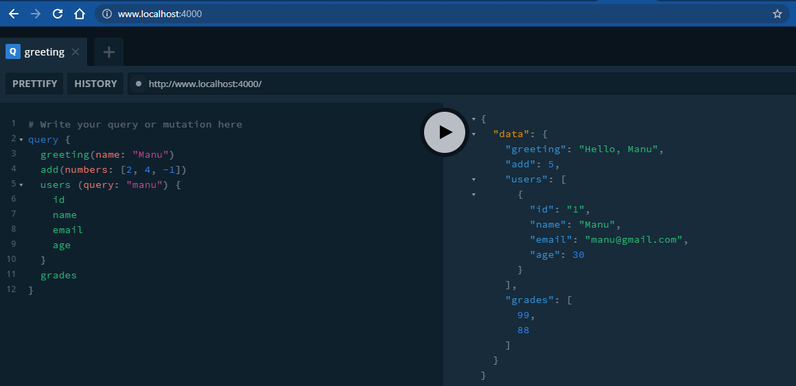
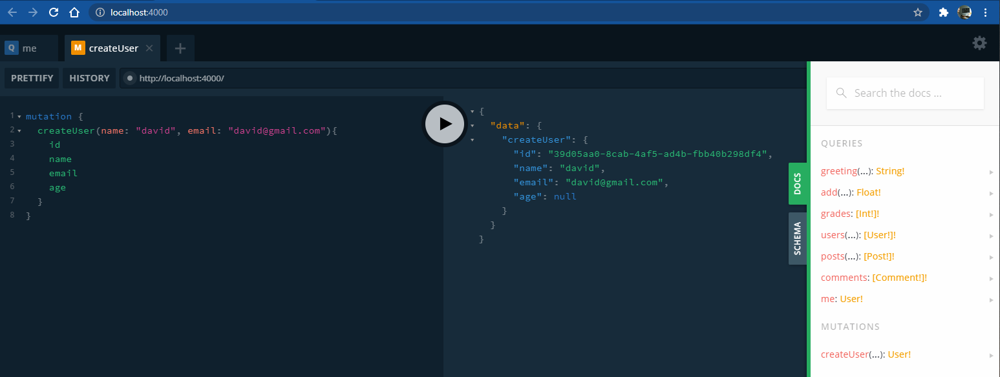
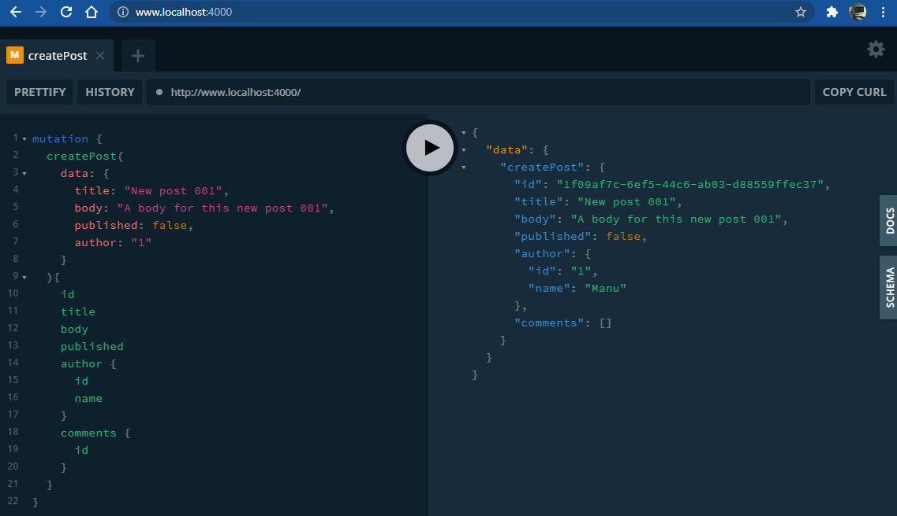

# GraphQL | The Complete Guide

A complete guide about GraphQL, using Node.js, Prisma, authentication, Apollo Client, and more!

## 1. Basics

### 1.1. Setup

- Babel CLI and presets: `$ npm install --save-dev @babel/core @babel/cli @babel/preset-env @babel/node`
- Your own GraphQL API with [GraphQL Yoga](https://github.com/dotansimha/graphql-yoga): `$ npm i graphql-yoga`

### 1.2. Schemas and Queries

- Example basic query with scalar types (single values: ID, String, Int, Float, Boolean), custom types and arrays:

  

- When we set a field whose value is one of our custom fields, we need to define a function/method that tells GraphQL how to get it. To do so, we need to define a new route on resolvers that matches with the parent property (e.g. `Post`), and set the methods for each of our fields that actually goes to another custom type (e.g. `author`).

### 1.3. Mutations

- uuid [package](https://www.npmjs.com/package/uuid): `$ npm i uuid`
- Example basic mutation:

  

- Input types can only have scalar values. So it cannot have a custom (object) type. Example `data` input with type `CreatePostInput`:

  

- When you delete some data you need to delete also the existing related data. For example, if you delete a user, you also have to delete the posts and comments created by that user.

- You can break the type definitions (`typeDefs`) out into their own file which is the preferred approach for a real world production graphQL applications (e.g. `schema.grapqhql`).
- You can set up `context` for the application that will be shared across your app like the mock data (db).

- **NOTE**: By default, `nodemon` looks for files with the .js, .mjs, .coffee, .litcoffee, and .json extensions. However, you can specify your own list with the `-e` (or `--ext`) switch like so: `nodemon src/index.js --ext js,graphql --exec babel-node`

### 1.4. Subscriptions

- GraphQL subscriptions use web sockets behind the scenes which keeps an open channel of communication between the client and the server. This is super useful for chat apps and real time ordering apps.
- GraphQL Yoga comes with a simple npm package, [GraphQL subscriptions](https://github.com/apollographql/graphql-subscriptions), that lets you wire up GraphQL with a pubsub system (like Redis) to implement subscriptions in GraphQL.
  - `PubSub` instance is a simple pubsub implementation, based on `EventEmitter`;
  - You must implement your Subscriptions type resolver, using the `pubsub.asyncIterator` to map the event you need, e.g. `count`;
  - `pubsub.publish` is what allows to publish new data to all of the subscribers. The first argument is the channel name that must match it up exactly with the supported channel, e.g. `count`, and the second argument will be an object (aligned with the `Subcription` type in the `schema.graphql` with the data that should get sent to the client.
